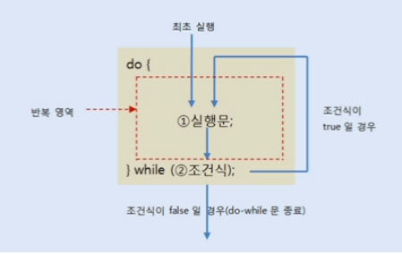

# 조건문 및 반복문
## 조건문
### if/elsif 문
- if (조건식 1) {
		실행문; // 조건식 1이 참일때 실행
} 
 else if (조건식 2) {
		실행문; // 조건식 1은 거짓, 조건식 2가 참일때 실행
} 
 else if (조건식 3) {
		실행문; // 조건식 1, 2는 거짓, 조건식 3이 참일때 실행
} 
 else if (조건식 4) {
		실행문; // 조건식 1, 2, 3은 거짓, 조건식 4가 참일때 실행
} 
 else {
		실행문; // 위의 조건식 모두 다 거짓일 경우
}

### switch/case 문
- switch (변수) { // 변수에는 정수타입, 문자, 문자열 (자바 7+) 올 수 있음 
		case 값 1: // 변수 == 값 1
			문장;
			break; // case에 맞으면 switch문을 빠져나가라 
		case 값 2: // 변수 == 값 2
			문장;	
			break; // case에 맞으면 switch문을 빠져나가라 
		case 값 3: // 변수 == 값 3
			문장;
			break; // case에 맞으면 switch문을 빠져나가라 
		... 
		default: // 다 아닐 경우
			문장;
			break; // case에 맞으면 switch문을 빠져나가라 
}

## 반복문
### while 문
- 주어진 조건에 맞는 동안(true) 지정된 수행문을 반복적으로 수행한다.
- 조건이 맞지 않으면 반복하던 수행을 멈춘다.
- 1부터 10까지 더하여 결과를 출력하는 예제
  

public class WhileTest {

	public static void main(String[] args) {

		int num = 1;
		int sum  = 0;
		
		while( num <= 10) {
			
			sum += num;
			num++;
		}
		
		System.out.println(sum);
		System.out.println(num);
	}

}

### do-while 문
- 조건과 상관없이 한번 실행한 후, 반복을 수행한다.

import java.util.Scanner;

public class DowhileTest {

	public static void main(String[] args) {

		Scanner scanner = new Scanner(System.in);
		int input; 
		int sum = 0;

		do {
			input = scanner.nextInt();
			sum += input;
			
		}while(input != 0);

			
		System.out.println(sum);
	}

}

- 흐름도
  
  

### for문
- for문의 수행 순서 

  