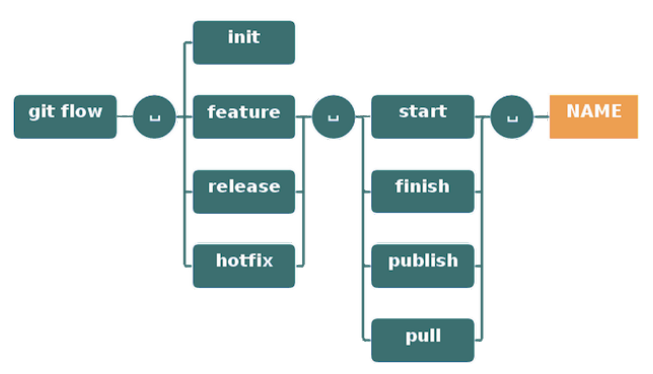

# Gitflow
- git flow init 명령어를 입력하는 것으로 시작!
- develop branch가 생성되고 해당 branch로 이동됨
- git flow feature start {파일명}  : 해당 파일명으로 feature branch에서 작업 시작! 추후 이것을 develop branch로 넣어줄 것
- 원하는 기능으로 작동하는 코드를 입력 후 git flow feature finish {파일명}
- 그러면 develop branch에 해당 기능이 삽입됨
- 그 다음은 develop으로부터 release branch 생성
- git flow release start {파일명. ex)v0.1}
- git flow release finish {파일명. ex)v0.1}
- git flow release를 하는 순간 해당 내용을 main branch와 develop branch에 하나씩 넘겨주게 된다.
- 이 후 창이 3번 뜬다.
  - 1. main branch와 merge 되는 것에 대한 commit
  - 2. main branch에 남을 tagging(설명 입력) : note의 개념
  - 3. develop branch와 merge 되는 것에 대한 commit
- 이후 github에 업로드 할때 remote repository와 local repository가 다르므로, git push -u origin develop 이라는 명령어를 입력해서 동기화시킴  : -u은 처음 한번만 입력하면 됨
- git switch main으로 이동해서 git push origin main 입력
- git tag를 통해 tag 확인
- git push --tags : 발행된 tag들 모두 push
- 이것을 바탕으로 release를 발행할 수 있다.

## Gitflow의 과정

## Gitflow의 명령어 형태

