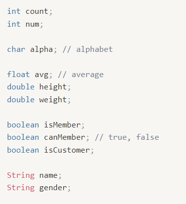

# 컴퓨터에서의 자료 표현
- 2진수로 표현(0과1로 데이터를 저장)
- bit : 컴퓨터가 표현하는 데이터의 최소 단위
  byte : 1byte = 8bit

  ## -2진수, 8진수, 16진수
  
  
## 변수와 상수
### 리터럴(literal)
- 데이터 값 자체
- 변수에 담기는 변하지 않는 데이터
  - 정수 리터럴, 실수 리터럴, 문자 리터럴, 문자열 리터럴, 논리 리터럴 등
### 변수(variables)
- 변할 수 있는 수 자체가 **아님**
- 변할 수 있는 수를 저장하는 **공간**
- 정의하는 방법
  - **자료형** + **변수 이름**
  - 변수는 의미있게 짓기!
  - 영문자(대,소문자), 숫자, _, $로만 구성 가능
  - **숫자로 시작하거나 공백을 포함할 수 없음!**
  - 이미 정의된 키워드나 예약어는 사용할 수 없음
  - 다음의 예시 참고   
     
  - 변수는 초기화 되어야 사용할 수 있다.
  - 변수는 선언되는 위치에 따라 글로벌 변수와 로컬 변수로 나뉘어진다.
    - 글로벌 변수 : 광범위하게 사용 가능
    - 로컬 변수 : 선언한 블록 내에서만 사용 가능

### 상수(contant)
- 변하지 않고 고정된 값을 담는 변수
- 가독성이 좋고, 편하게 작업할 수 있다는 장점이 있다.
- 상수의 선언은 기존 변수 선언 앞에 'final' 붙이면 된다.   

## 기본 자료형의 종류, 그리고 정수와 실수의 표현
### -기본 자료형의 종류
 
  
### -정수
 
- 기본적으로 정수는 int형이 할당된다.

 

### -실수
- 실수는 정수보다 정밀하기 때문에 다른 방식으로 표현해야 한다.
- 부동소수점 방식으로 0.1을 표현하면 다음과 같다. 

   

- 컴퓨터에서는 밑수를 2로 사용한다.
- 정규화 : 가수가 밑수보다 작은 한 자리까지 가수로 표현하는 것
- 컴퓨터에서는 정규화를 하면 가수 첫째 자리는 항상 1이다.
  - ex) 0.2를 정규화해서 표현하면 1.6 * 2^(-3)
- float형과 double형

    
- 자바에서 실수의 기본 타입은 double형이다.
- 실수는 정밀한 수이기 때문에 **형 변환**을 하게 되면 **데이터의 손실이 발생**한다.
