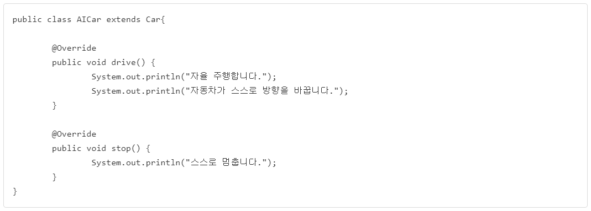

# 추상클래스
## 추상클래스는 무엇인가?
- 구현 코드 없이 메서드의 선언만 있는 추상 메서드를 포함한 클래스를 말한다.
- 예) int add(int x, int y);  ->선언만 한것(추상메서드)
- 예) int add(int x, int y){} ->구현부가 있음.
- 추상클래스는 **abstract** 예약어를 사용한다.
- **추상클래스는 new 할 수 없다!!!**
- 추상클래스의 추상메서드는 하위 클래스가 상속하여 구현한다.

## 추상클래스의 응용
### 템플릿 메서드 패턴
- 추상 메서드나 구현된 메서드를 활용해서 코드의 흐름을 정하는 메서드
- final로 선언하여 하위 클래스에서 재정의 할 수 없게 한다!!
- 프레임워크에서 많이 사용되는 패턴
- **추상 클래스로 선언된 상위 클래스에서 템플릿 메서드를 활용하여 전체적인 흐름을 정하고, 하위 클래스에서 다르게 구현되어야 하는 부분은 추상 메서드로 선언(선언은 상위클래스에서)하여 하위 클래스에서 구현하도록 하는 방식**
   
## 추상클래스와 템플릿 메서드의 응용 예시
 

 

 

 

 

