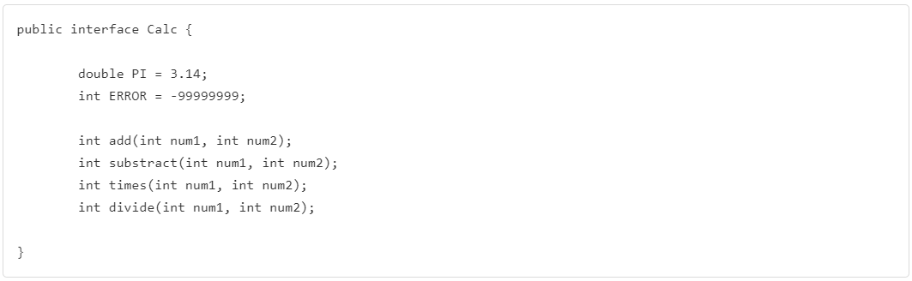
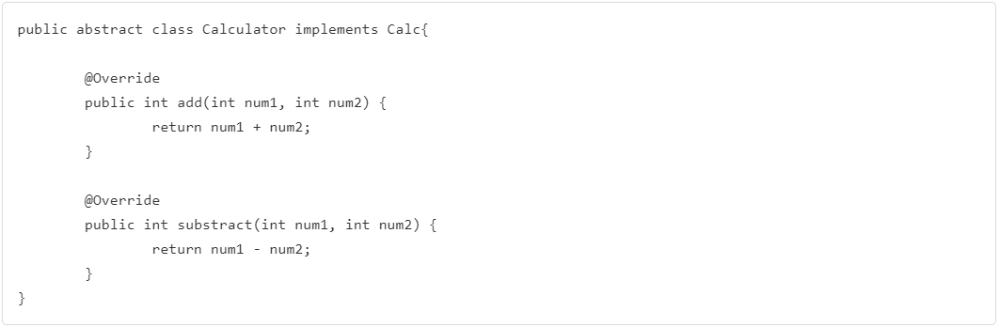

# 인터페이스(Interface)
- 인터페이스에서 모든 메서드는 추상 메서드로 선언된다! 즉, 선언만 하고 구현은 하지 않음!!
- 모든 변수는 상수로 선언된다. (public static final)
- 인터페이스 정의와 구현은 다음 예시를 참고해보자!
    
  
    
  
    
  
    
  

    
  
## 인터페이스의 역할
- 클래스나 프로그램이 제공하는 기능을 간략히 보여준다.
- 명세(specification)
- 클라이언트 프로그램은 인터페이스에 선언된 메서드 명세만 보고, 편리하게 클래스를 사용할 수 있다.
- 어떤 객체가 하나의 인터페이스 타입이라는 것은 그 인터페이스의 모든 메서드를 구현했다는 의미이다.
- 인터페이스를 구현한 다양한 객체를 사용(다형성)