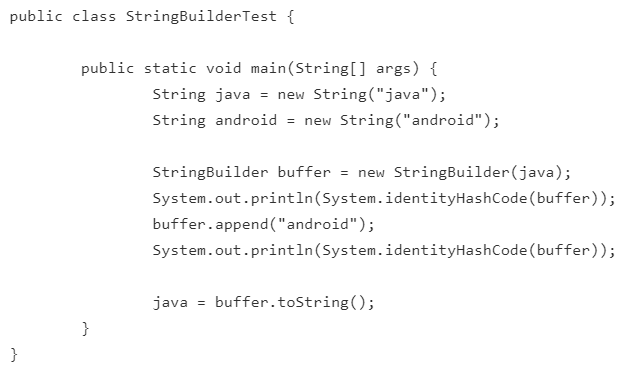
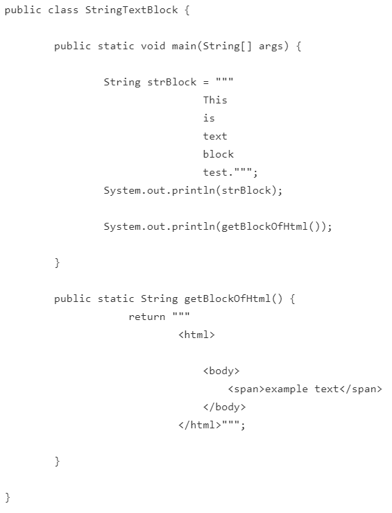

# String, StringBuilder, StringBuffer 클래스, 그리고 text block

## String 클래스
- 힙 메모리에 인스턴스로 생성되는 경우, 상수 풀(constant pool)에 있는 주소를 참조하는 경우, 이렇게 두 가지 방법이 있다.
- 힙 메모리는 생성될 때마다 다른 주소 값을 가지지만, 상수 풀의 문자열은 같은 주소 값을 가진다.
- 한 번 생성된 String 은 불변!!
- String을 연결하면 기존의 String에 연결되는 것이 아니고 연결한 새로운 문자열이 생성된다. --> 메모리 낭비 발생
  - 이런 메모리 낭비를 줄이기 위해 StringBuilder, StringBuffer를 활용한다!

  

## StringBuilder, StringBuffer의 활용
- 내부적으로 가변적인 char[]을 멤버 변수로 가진다.
- 문자열을 여러번 연결하거나 변경할 때 유용하다!
- 단일 쓰레드는 StringBuilder, 멀티 쓰레드는 StringBuffer 사용 권장!!
- 최종적으로 toString() 메서드를 사용해서 String으로 반환한다.
- **다음의 예시 참조**  

  
## textblock 사용하기
- 문자열을 """ """ 사이에 이어서 사용할 수 있다.
- **다음의 예시 참조**  

